# CO&T - Coffee and Tea Ordering System

<div align="center">

# **Sistem Pemesanan Digital untuk Kedai Kopi & Teh**

Aplikasi web modern untuk memudahkan pelanggan memesan minuman dan membantu kasir memverifikasi pesanan menggunakan QR Code.

[🌐 Live Demo](#) • [📖 Dokumentasi](#dokumentasi) • [🚀 Instalasi](#instalasi)

</div>

---

## 📋 Daftar Isi

- [Tentang Proyek](#-tentang-proyek)
- [Fitur Utama](#-fitur-utama)
- [Tech Stack](#-tech-stack)
- [Arsitektur Sistem](#-arsitektur-sistem)
- [Flowchart Alur Aplikasi](#-flowchart-alur-aplikasi)
- [Struktur Database](#-struktur-database)
- [Struktur Folder](#-struktur-folder)
- [Instalasi](#-instalasi)
- [Konfigurasi](#-konfigurasi)
- [Screenshot](#-screenshot)
- [Kontributor](#-kontributor)

---

## 📖 Tentang Proyek

**CO&T (Coffee and Tea)** adalah aplikasi web pemesanan minuman yang dikembangkan sebagai **Tugas Akhir Program Diploma 3**. Aplikasi ini memungkinkan pelanggan untuk:

- Melihat menu minuman dengan kategori
- Menambahkan item ke keranjang belanja
- Membuat pesanan dan mendapatkan QR Code
- Melakukan pembayaran via QRIS atau Cash di kasir

Untuk pihak kedai/kasir:

- Memverifikasi pesanan dengan scan QR Code
- Mengelola menu dan produk
- Melihat statistik dan laporan pesanan

### 🎯 Tujuan Pengembangan

1. Mempercepat proses pemesanan tanpa antrian panjang
2. Mengurangi kesalahan dalam pencatatan pesanan manual
3. Memberikan pengalaman digital yang modern kepada pelanggan
4. Memudahkan pengelolaan data pesanan dan menu

---

## ✨ Fitur Utama

### 👤 Fitur Pelanggan (Customer)

| Fitur                     | Deskripsi                                                                  |
| ------------------------- | -------------------------------------------------------------------------- |
| 🏠 **Landing Page**       | Halaman utama dengan hero section, featured products, dan informasi lokasi |
| 🔍 **Pencarian & Filter** | Cari menu berdasarkan nama dan filter berdasarkan kategori                 |
| 🛒 **Keranjang Belanja**  | Tambah, hapus, dan atur jumlah item pesanan                                |
| 📱 **QR Code Checkout**   | Generate QR Code untuk verifikasi pesanan di kasir                         |
| 💳 **Info Pembayaran**    | Instruksi pembayaran via QR Code atau Cash                                    |
| 📍 **Lokasi Toko**        | Google Maps embed untuk navigasi ke lokasi                                 |

### 👨‍💼 Fitur Admin/Kasir

| Fitur                       | Deskripsi                                |
| --------------------------- | ---------------------------------------- |
| 🔐 **Login Admin**          | Autentikasi untuk akses dashboard admin  |
| 📊 **Dashboard**            | Statistik produk, pesanan, dan kategori  |
| 🍽️ **Kelola Menu**          | CRUD produk (tambah, edit, hapus menu)   |
| 📋 **Kelola Pesanan**       | Lihat, filter, dan kelola semua pesanan  |
| 📷 **Scan QR Code**         | Verifikasi pesanan dengan scanner kamera |
| ✏️ **Input Manual**         | Input kode pesanan secara manual         |
| ✅ **Verifikasi & Selesai** | Update status pesanan                    |

---

## 🛠 Tech Stack

### Frontend

| Teknologi        | Versi  | Kegunaan                                    |
| ---------------- | ------ | ------------------------------------------- |
| **Vue.js 3**     | 3.5.22 | JavaScript framework dengan Composition API |
| **Vite**         | 7.1.7  | Build tool dan dev server yang cepat        |
| **Vue Router**   | 4.5.1  | Client-side routing                         |
| **Pinia**        | 3.0.3  | State management                            |
| **Tailwind CSS** | 3.4.18 | Utility-first CSS framework                 |

### Backend & Database

| Teknologi    | Kegunaan                                                                     |
| ------------ | ---------------------------------------------------------------------------- |
| **Supabase** | Backend-as-a-Service (BaaS) - Database PostgreSQL, Authentication, Real-time |

### Library Tambahan

| Library               | Kegunaan                           |
| --------------------- | ---------------------------------- |
| **qrcode**            | Generate QR Code untuk pesanan     |
| **vue-qrcode-reader** | Scanner QR Code menggunakan kamera |

### Deployment

| Platform   | Kegunaan                        |
| ---------- | ------------------------------- |
| **Vercel** | Hosting dan deployment aplikasi |

---

## 🏗 Arsitektur Sistem

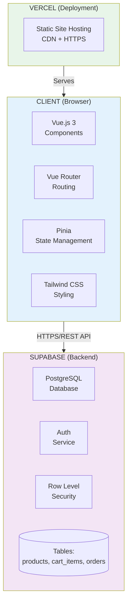

---

## 📊 Flowchart Alur Aplikasi

### 1. Alur Pemesanan (Customer Flow)

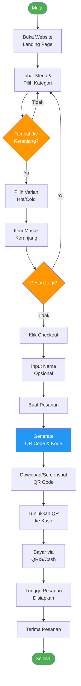
---
### 2. Alur Verifikasi Pesanan (Admin/Kasir Flow)

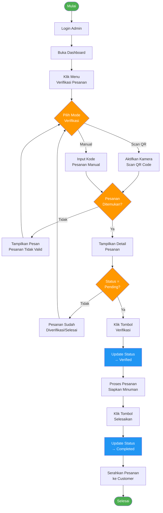

---
## DATA FLOW DIAGRAM (DFD)

### DFD Level 0 (Diagram Konteks)
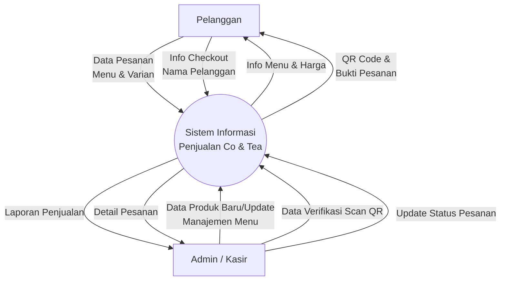

### DFD Level 1 (Diagram Proses)
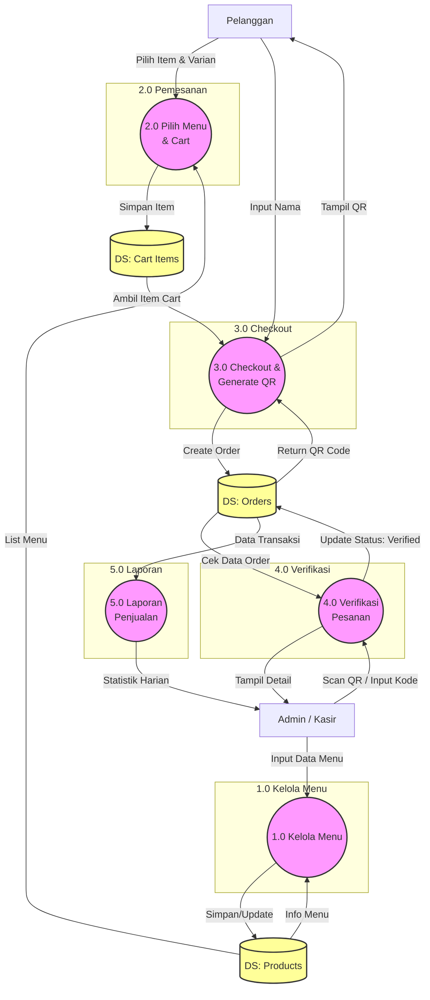
## 🗃 Struktur Database

### Tabel: `products`

| Kolom         | Tipe        | Deskripsi                           |
| ------------- | ----------- | ----------------------------------- |
| `id`          | UUID        | Primary Key                         |
| `name`        | VARCHAR     | Nama produk                         |
| `category`    | VARCHAR     | Kategori (Espresso Based, Tea, dll) |
| `price_hot`   | INTEGER     | Harga variant hot (dalam ribuan)    |
| `price_cold`  | INTEGER     | Harga variant cold (dalam ribuan)   |
| `image`       | TEXT        | URL gambar produk                   |
| `description` | TEXT        | Deskripsi produk                    |
| `is_favorite` | BOOLEAN     | Tampil di featured products         |
| `created_at`  | TIMESTAMPTZ | Waktu dibuat                        |

### Tabel: `cart_items`

| Kolom        | Tipe        | Deskripsi               |
| ------------ | ----------- | ----------------------- |
| `id`         | UUID        | Primary Key             |
| `session_id` | VARCHAR     | ID sesi browser (guest) |
| `product_id` | UUID        | Foreign Key ke products |
| `name`       | VARCHAR     | Nama produk             |
| `price`      | INTEGER     | Harga item              |
| `image`      | TEXT        | URL gambar              |
| `variant`    | VARCHAR     | Hot / Cold              |
| `quantity`   | INTEGER     | Jumlah item             |
| `created_at` | TIMESTAMPTZ | Waktu dibuat            |

### Tabel: `orders`

| Kolom           | Tipe        | Deskripsi                      |
| --------------- | ----------- | ------------------------------ |
| `id`            | UUID        | Primary Key                    |
| `order_code`    | VARCHAR(10) | Kode unik pesanan (6 karakter) |
| `customer_name` | VARCHAR     | Nama pelanggan                 |
| `items`         | JSONB       | Detail item pesanan            |
| `total_price`   | INTEGER     | Total harga (Rupiah)           |
| `status`        | VARCHAR     | pending / verified / completed |
| `created_at`    | TIMESTAMPTZ | Waktu pesanan dibuat           |
| `verified_at`   | TIMESTAMPTZ | Waktu diverifikasi             |
| `completed_at`  | TIMESTAMPTZ | Waktu selesai                  |

### Entity Relationship Diagram (ERD)

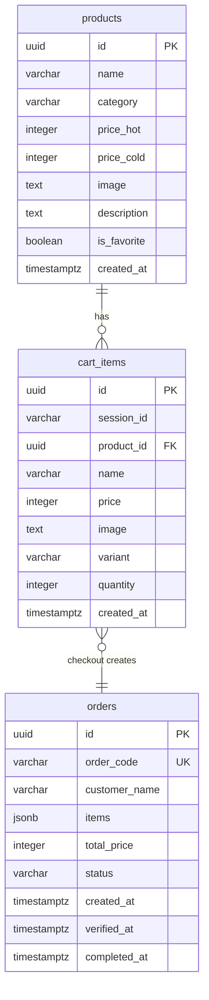

---

## 📁 Struktur Folder

```
project-co-and-tea/
├── public/                    # Static assets
│   └── favicon.ico
├── src/
│   ├── assets/               # Images, fonts, etc
│   │   └── main.css          # Global styles
│   ├── components/           # Reusable Vue components
│   │   ├── admin/            # Admin-related components
│   │   │   ├── AdminHeader.vue
│   │   │   ├── AdminStats.vue
│   │   │   ├── ProductForm.vue
│   │   │   └── ProductTable.vue
│   │   ├── cart/             # Cart components
│   │   │   └── CartItem.vue
│   │   ├── checkout/         # Checkout components
│   │   │   └── CheckoutModal.vue
│   │   ├── common/           # Common/shared components
│   │   │   ├── SkeletonCard.vue
│   │   │   ├── SuccessAnimation.vue
│   │   │   └── ToastNotification.vue
│   │   ├── landing/          # Landing page components
│   │   │   ├── HeroSection.vue
│   │   │   ├── FeaturedProducts.vue
│   │   │   ├── MenuSection.vue
│   │   │   └── LocationSection.vue
│   │   ├── layout/           # Layout components
│   │   │   ├── Navbar.vue
│   │   │   └── Footer.vue
│   │   └── product/          # Product components
│   │       ├── ProductCard.vue
│   │       └── ProductVariantModal.vue
│   ├── config/               # Configuration files
│   │   └── constants.js      # App constants & helpers
│   ├── router/               # Vue Router configuration
│   │   └── index.js
│   ├── stores/               # Pinia state management
│   │   ├── cartStore.js      # Cart state
│   │   ├── orderStore.js     # Order state
│   │   └── productStore.js   # Product state
│   ├── composables/          # Vue composables (reusable logic)
│   │   └── useFeedback.js    # Toast/notification helpers
│   ├── views/                # Page components
│   │   ├── admin/
│   │   │   ├── DashboardView.vue
│   │   │   └── LoginView.vue
│   │   ├── CartView.vue
│   │   ├── HomeView.vue
│   │   └── VerifyOrderView.vue
│   ├── App.vue               # Root component
│   ├── main.js               # App entry point
│   └── supabase.js           # Supabase client config
├── supabase/
│   └── migrations/           # Database migrations
│       └── create_orders_table.sql
├── .env                      # Environment variables
├── index.html                # HTML template
├── package.json              # Dependencies
├── tailwind.config.js        # Tailwind configuration
├── vite.config.js            # Vite configuration
├── vercel.json               # Vercel deployment config
└── README.md                 # Documentation
```

---

## 🚀 Instalasi

### Prasyarat

- **Node.js** v20.19.0+ atau v22.12.0+
- **npm** v10+
- **Git**
- Akun **Supabase** (gratis)

### Langkah-langkah

1. **Clone repository**

   ```bash
   git clone https://github.com/username/project-co-and-tea.git
   cd project-co-and-tea
   ```

2. **Install dependencies**

   ```bash
   npm install
   ```

3. **Setup Environment Variables**

   Buat file `.env` di root folder:

   ```env
   VITE_SUPABASE_URL=your_supabase_project_url
   VITE_SUPABASE_ANON_KEY=your_supabase_anon_key
   ```

4. **Setup Database**

   Jalankan migration SQL di Supabase SQL Editor:

   - Buka file `supabase/migrations/create_orders_table.sql`
   - Copy dan jalankan di Supabase Dashboard > SQL Editor

5. **Run Development Server**

   ```bash
   npm run dev
   ```

6. **Buka di Browser**
   ```
   http://localhost:5173
   ```

---

## ⚙ Konfigurasi

### Environment Variables

| Variable                 | Deskripsi                      |
| ------------------------ | ------------------------------ |
| `VITE_SUPABASE_URL`      | URL project Supabase           |
| `VITE_SUPABASE_ANON_KEY` | Anon/Public key Supabase       |
| `VITE_WHATSAPP_NUMBER`   | (Opsional) Nomor WhatsApp toko |

### Supabase Setup

1. Buat project baru di [Supabase](https://supabase.com)
2. Buat tabel `products`, `cart_items`, dan `orders`
3. Enable Row Level Security (RLS)
4. Setup authentication untuk admin

---

## 📸 Screenshot

### Landing Page (Customer)

- Hero section dengan branding
  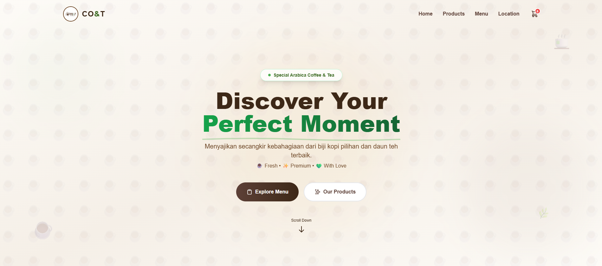

- Featured products
  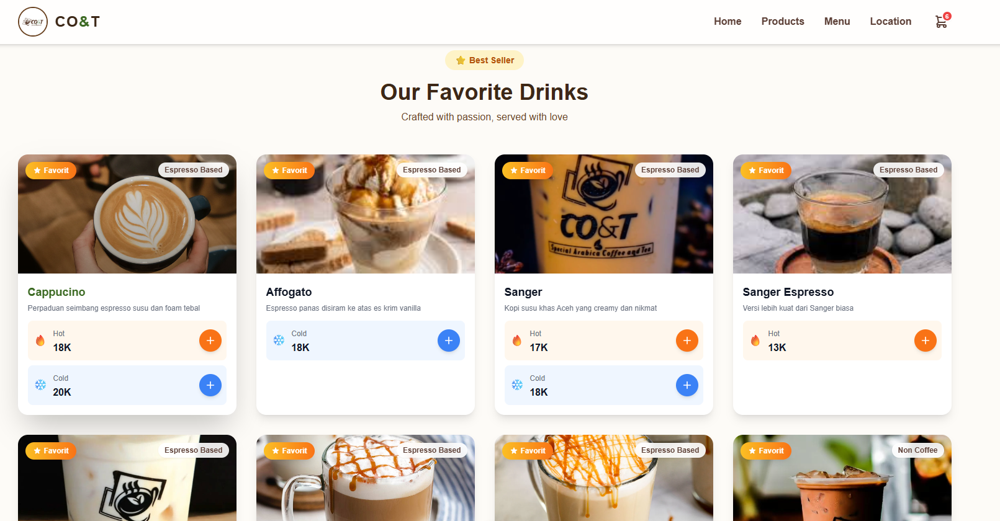

- Menu dengan kategori filter
  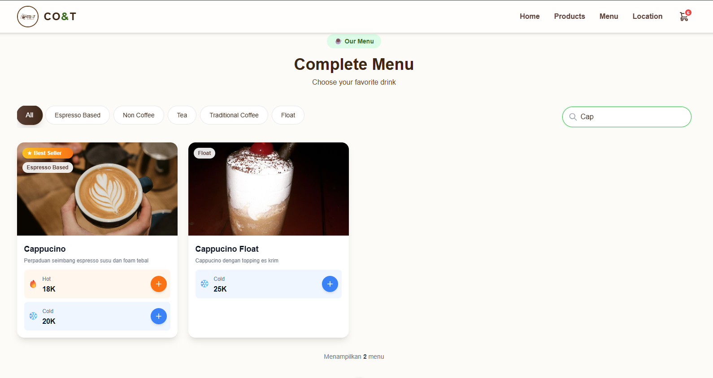

- Lokasi toko dengan Google Maps
  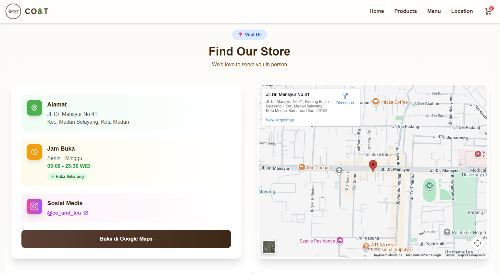

### Cart & Checkout

- Keranjang belanja
  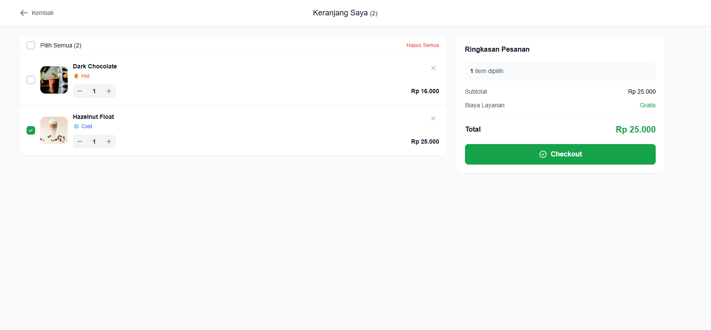

- Modal checkout dengan QR Code

  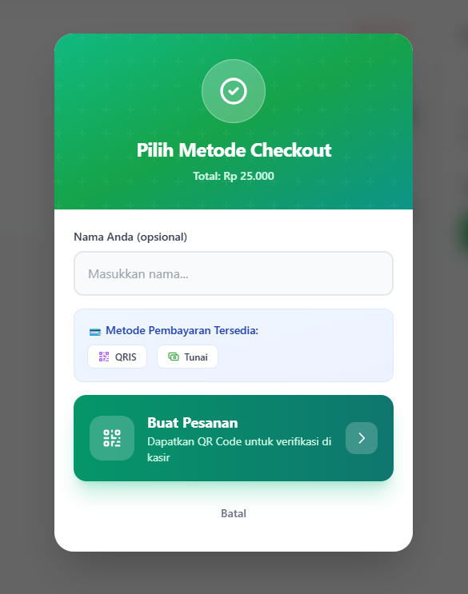

- Instruksi pembayaran QRIS/Cash<table>
  <tr>
    <td align="center">
      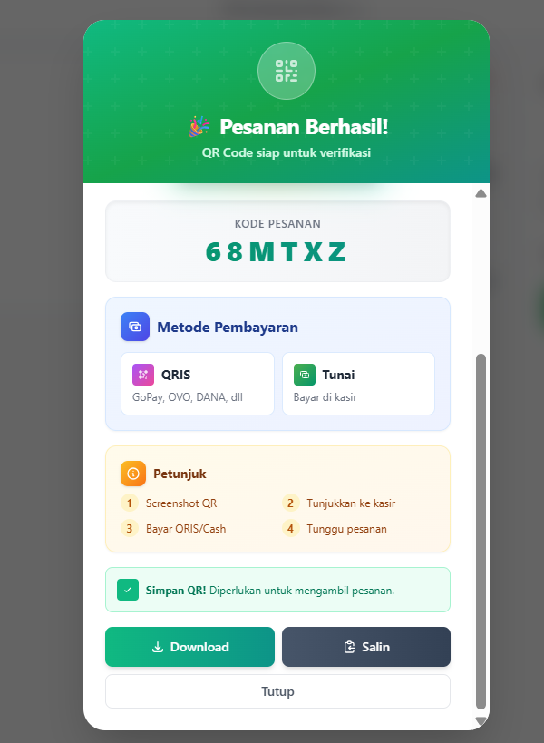
      <br><em>Modal bagian atas</em>
    </td>
    <td align="center">
      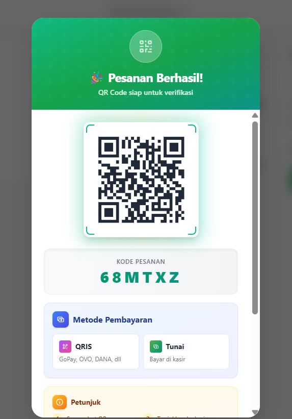
      <br><em>Modal bagian bawah</em>
    </td>
  </tr>
</table>

### Admin Dashboard

- Statistik overview
  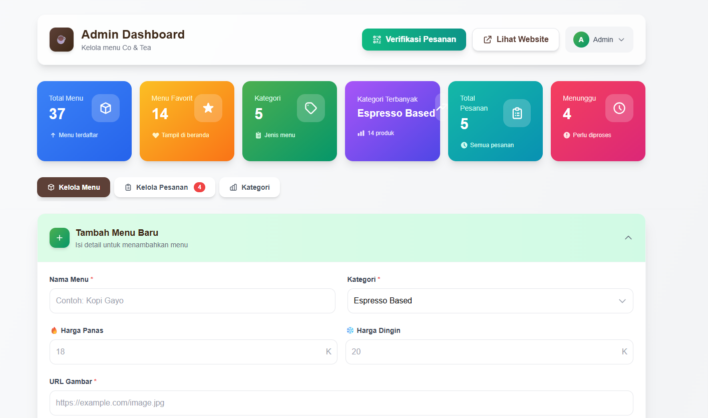

- Kelola menu (CRUD)
  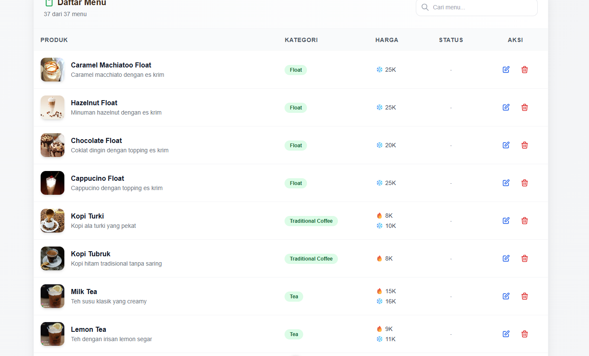
- Kelola pesanan
  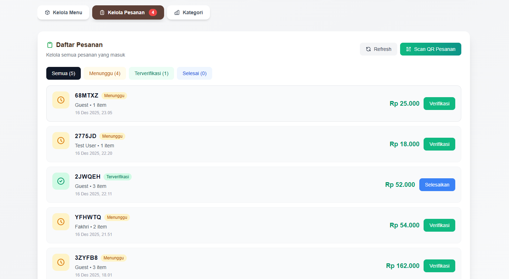

- Verifikasi QR Code
  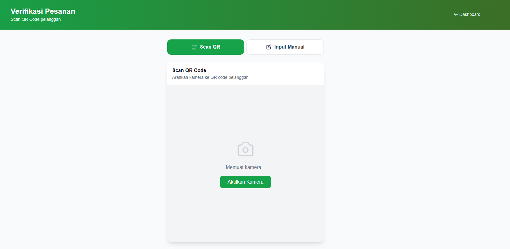

---

## 🔧 Scripts

| Command           | Deskripsi                   |
| ----------------- | --------------------------- |
| `npm run dev`     | Jalankan development server |
| `npm run build`   | Build untuk production      |
| `npm run preview` | Preview production build    |

<div align="center">

**Dibuat dengan ❤️ menggunakan Vue.js & Supabase**

© 2024-2025 CO&T - Coffee and Tea Ordering System

</div>
